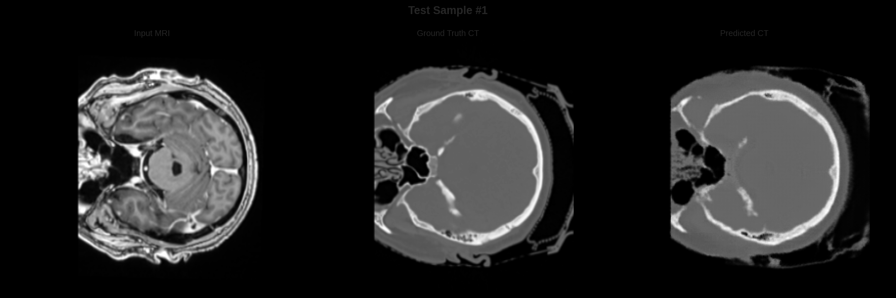
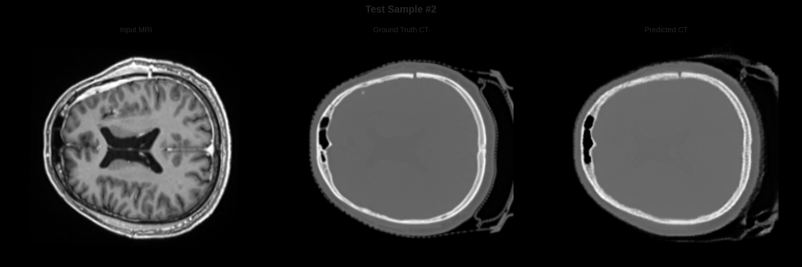
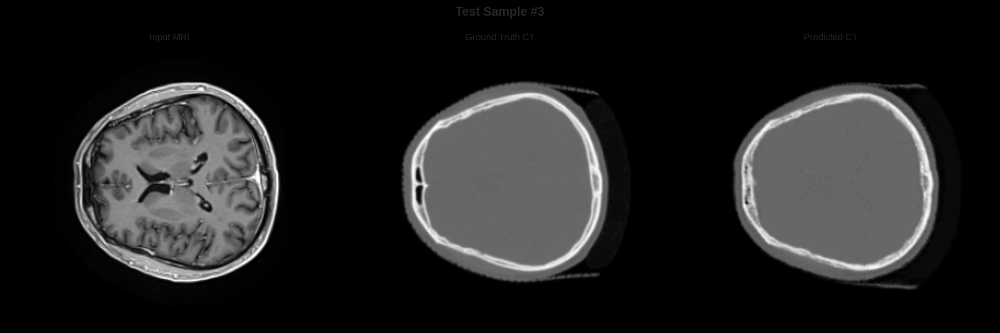
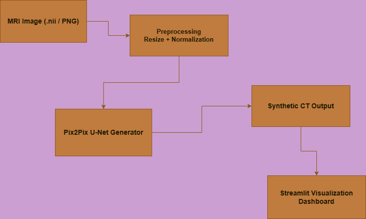
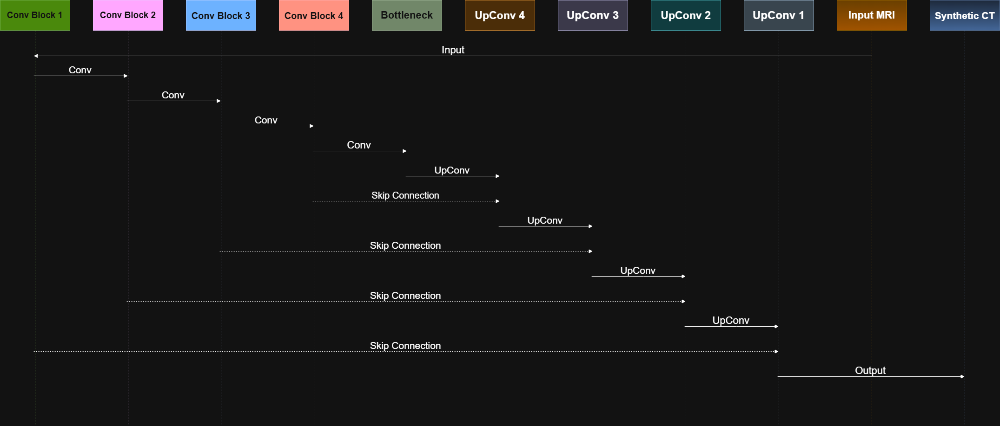
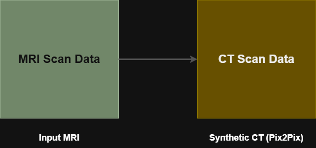

# MRI → CT Image Translation using Deep Learning

---

## Student Information

**Student:** Pooja Vilas Gadhe  
**Student Code:** IITMCS_24061184  
**Institution:** IIT Mandi (Online Minor - Degree Program)  
**Project:** MRI-to-CT Image Translation using Deep Learning

---

# Project Overview

Radiotherapy treatment planning typically requires **both MRI and CT scans**.

CT scans provide **electron density information** needed for dose calculation, while MRI provides **better soft tissue contrast**.

This project investigates **MRI-only radiotherapy planning** by generating **synthetic CT (sCT)** images directly from MRI scans using deep learning.

### Goals

• Eliminate CT acquisition  
• Reduce patient radiation exposure  
• Avoid MRI–CT registration errors  
• Improve radiotherapy workflow efficiency  

---

# Interactive Demo

The project includes an **interactive Streamlit application**.

Users can:

• Upload MRI slices (.png)  
• Upload MRI volumes (.nii)  
• Generate synthetic CT images  
• Compare MRI vs CT using an interactive slider  
• Visualize model performance metrics  

### Demo Interface

    Upload MRI
    ↓
    Model Inference
    ↓
    Synthetic CT
    ↓
    Interactive Comparison

---

## Example Results

| MRI | Ground Truth CT | Generated CT |
|-----|-----------------|--------------|
|  |  |  |
---

# Dataset

**Dataset**

181 paired brain MRI–CT scans.

**Medical imaging format**
     
     NIfTI (.nii)

 
### Processed Dataset

21,183 2D slices extracted from MRI–CT pairs.

### Data Split

| Split | Percentage |
|-------|------------|
| Training | 70% |
| Validation | 15% |
| Test | 15% |

Splitting was performed **patient-wise** to avoid data leakage.

---

# Preprocessing Pipeline

    MRI Volume
    ↓
    Slice Extraction
    ↓
    Resize to 256×256
    ↓
    Intensity Clipping
    ↓
    Normalization [-1,1]

---

# Model Architectures

Three deep learning architectures were implemented.

---

## 1. U-Net with Local Decoder

Improves **fine anatomical detail reconstruction**.

### Architecture

    Encoder → Bottleneck → Local Decoder → CT Output

**Loss**
L1 Loss
+
SSIM Loss

**Parameters**
  - 31M

---

## 2. Pix2Pix U-Net with PatchGAN

GAN-based model for **high perceptual realism**.

### Architecture

    MRI → U-Net Generator → Synthetic CT
    ↑
    PatchGAN Discriminator

**Loss**
L1 Loss
Feature Matching
Gradient Difference Loss

**Parameters**
 - 31M

---

## 3. Turbo U-Net

Lightweight architecture optimized for **efficiency**.

### Architecture

    Residual Encoder → Efficient Decoder → CT

**Loss**
L1 + SSIM + MS-SSIM + Adversarial

**Parameters**
  - 8M

---

# Performance Evaluation

Models were evaluated on **3,120 test slices**.

### Evaluation Metrics

• SSIM  
• PSNR  
• MAE (Hounsfield Units)

| Model | SSIM | PSNR | MAE  |
|-------|------|------|------|
| U-Net + Local Decoder | 0.8725 | 25.17 | 69 HU |
| Pix2Pix PatchGAN | **0.93–0.95** | **26.04** | **39.07 HU** |
| Turbo U-Net | 0.8118 | 22.88 | 95.13 HU |

---

# Performance Insights

**Best Detail Preservation**

U-Net + Local Decoder achieved the highest structural similarity.

**Most Reliable**

Pix2Pix PatchGAN achieved the **lowest MAE**.

**Most Efficient**

Turbo U-Net reduced parameters by **75%** while maintaining acceptable accuracy.

---

# Project Structure

    Capstone-Project
    │
    ├── app
    │ └── app.py # Streamlit application
    │
    ├── src
    │ ├── model.py # Model architectures
    │ ├── inference.py # Model inference
    │ └── preprocess.py # Data preprocessing
    │
    ├── models
    │ └── best_model_G.pth # Trained model
    │
    ├── results
    │ ├── pix2pix_unet
    │ │ ├── test_sample_1.png
    │ │ ├── test_sample_2.png
    │ │ └── ...
    │ │
    │ ├── training_history.json
    │ └── test_set_results.json
    │
    ├── notebooks # Training notebooks
    ├── requirements.txt
    └── README.md

---

# Running the Application

### Clone repository
    git clone https://github.com/yourusername/capstone-project.git
cd capstone-project

### Install dependencies
    pip install -r requirements.txt

### Launch the demo
    streamlit run app/app.py

---

# Future Work

To translate these research results into clinical practice:

### Clinical Validation

Evaluate performance within real radiotherapy treatment workflows.

### Dosimetric Validation

Verify that synthetic CT images produce acceptable dose distributions.

### Multi-Institution Training

Improve generalization using larger datasets.

### Multi-Region Extension

Extend the method to:

• pelvis  
• abdomen  
• thorax  

---

# Technologies Used

| Tool | Purpose |
|------|---------|
| PyTorch | Deep learning framework |
| Streamlit | Interactive web application |
| Nibabel | Medical image processing |
| NumPy | Numerical computation |
| Matplotlib | Visualization |

---

# Acknowledgements

This project was developed as part of the **IIT Mandi Online Minor - Degree Capstone Project**.

The work demonstrates the potential of deep learning for improving **medical imaging workflows in radiotherapy planning**.

## Pipeline

  

<b>Figure 1:</b> End-to-end pipeline for generating synthetic CT from MRI.

## Model Architecture

  

<b>Figure 2:</b> Generator–discriminator architecture used for MRI-to-CT translation.

## Example Results

  

<b>Figure 3:</b> Example MRI input, ground truth CT, and generated synthetic CT.

